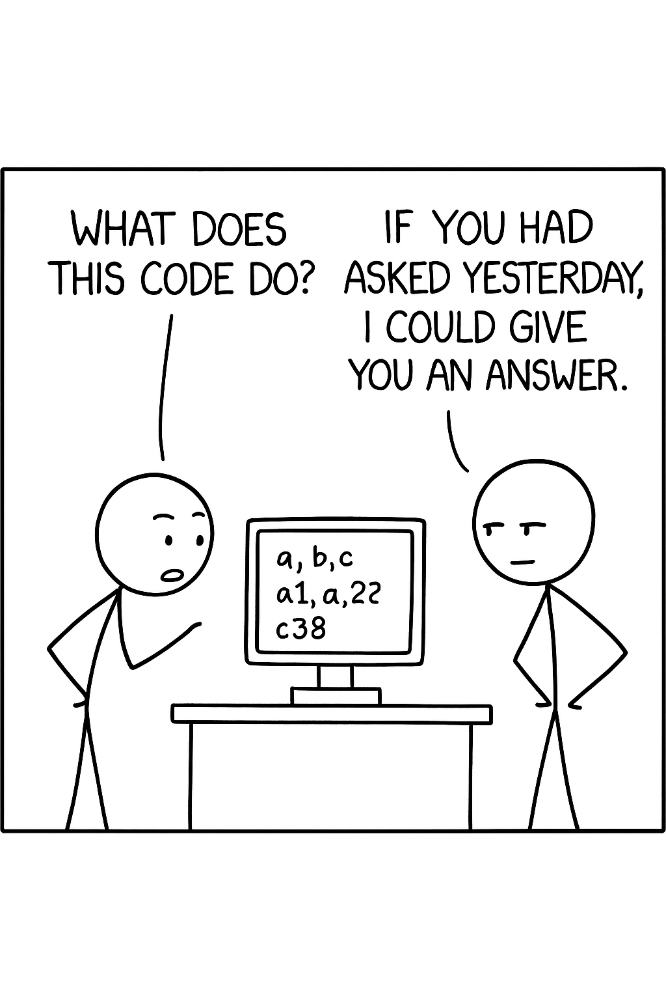

## Code written without coding standard

The wrote my first few programs in Python with no awareness of coding standard. Although I have lost the code of these programs, I would show you how those code might look like in JavaScript.

```
function a(b : number[]) {
  let d = 0;
  for (let i = 0; i < b.length; i++) {
    d += b[i];
  }
  return d;
}

function a1(c : number) {
  if (c < 0) {
    return -c;
  }
  return c;
}
```



The first thing you might have notice is that function names and variable names are single letters with numbers, having no intuitive sign of what they are and why they are there, and you have to read the code to figure those out. This would be a disaster if the code were more lengthy and complicated than what was above. I have a quote critisizing those kind of code from the internet: "Today, only me and god knows what this piece of code does. Half years later, only god knows."

## Give meaningful names

The first I learned that has to with coding standard was to give meaningful names to functions and variables. Even if you could eventually figure out the logic behind the code that was named after meaningless letters and numbers, you spent time that you could have saved by letting the person who wrote the code give meaningful name.

```
function summation(arr : number[]) {
  let sum = 0;
  for (let index = 0; index < arr.length; index++) {
    sum += arr[index];
  }
  return sum;
}

function absoluteValue(num : number) {
  if (num < 0) {
    return -num;
  }
  return num;
}
```

Programs could be clarified more by putting comments nearby.

```
// Returns the sum of each number in `arr`.
function summation(arr : number[]) {
  let sum = 0;
  for (let index = 0; index < arr.length; index++) {
    sum += arr[index];
  }
  return sum;
}

// Returns the absolute value of `num`.
function absoluteValue(num : number) {
  if (num < 0) {      // `num` is negative, negate `num` and then return the result.
    return -num;
  }
  return num;         // `num` is 0 or positive, return `num` directly.
}
```

## Me following a well documented coding standard

In my program structure class, we had a well documented coding standard that we have to following while writing code for our assignments. We get points deducted if we failed to meet anything specified in the standard. Compared to my previous classes, which no coding standard were enforced and everyone wrote their code in style however they like, program structure class really challenged us on our ability of following instruction of a standard.

Even though the class teaches the C and C++ programming language and assignment were written in those two languages, I would show you using JavaScript how a piece of code might look like following this coding standard.

```
/*****************************************************************
//
//  Function name:  summation
//
//  DESCRIPTION:    Calculates and returns the sum of each
//                  number in `arr`.
//
//  Parameters:     arr (number[]) : Array to calculate the
//                                   sum.
//
//  Return values:  The sum of each number in `arr`.
//
****************************************************************/

function summation(arr : number[])
{
  let sum = 0;

  for (let index = 0; index < arr.length; index++)
  {
    sum += arr[index];
  }

  return sum;
}

/*****************************************************************
//
//  Function name:  absoluteValue
//
//  DESCRIPTION:    Calculates and returns the absolute value
//                  of `num`.
//
//  Parameters:     num (number) : Number to figure out the
//                                 absolute value.
//
//  Return values:  The absolute value of `num`.
//
****************************************************************/

function absoluteValue(num : number)
{
  let result = num;

  if (num < 0)
  {
    result = -result;
  }

  return result;
}
```

For small functions like those two above does not have much to explain, but that large block of comment above each function's definition would be really helpful if the function was long. As an example, below is about 1/4 of a C main function from one of my assignments. You could tell this main function is basically an user interface by reading only the comment above the function definition, rather than the entire main function, which was 185 lines of code.

```
/*****************************************************************
//
//  Function name: main
//
//  DESCRIPTION:   Interacts with the user and calls appropriate
//                 database functions upon user's request.
//
//  Parameters:    argc (int) : number of arguments
//                 argv (char*[ ]) : array of arguments
//
//  Return values:  0 : success
//
****************************************************************/

int main(int argc, char* argv[ ])
{
    struct record* start = NULL;
    int programTask;
    int optionResult;
    int index;
    int temporary;
    int inputState;
    int inputSize;
    int accountNumber;
    char userName[25];
    char userAddress[45];
    char option[5][9];
    char optionSelection[50];
    char savedData[50];

    debugmode = 0;
    programTask = 0;
    optionResult = 0;
    index = 1;
    while (index < argc && programTask != -1)
    {
        if (strcmp(argv[index], "debug") == 0 && debugmode == 0)
        {
            debugmode = 1;
        }
        else
        {
            debugmode = 0;
            programTask = -1;
        }
        ++index;
    }

    if (programTask == -1)
    {
        printf("\n%s\n\n", "Invalid command line argument. Program exited.");
    }
    else
    {
        strcpy(savedData, "data.txt");
        optionResult = readfile(&start, savedData);

        strcpy(option[0], "add");
        strcpy(option[1], "printall");
        strcpy(option[2], "find");
        strcpy(option[3], "delete");
        strcpy(option[4], "quit");

        printf("\n%s\n\n", "Welcome. You can use this program to manipulate user records.");
        do
        {
            do
            {
                programTask = 0;
```

In addition to comments, the coding standard from my program structure class also enforces letting curly braces occupy one whole line, and group codes by what they do. This creates reasonable amount spaces between codes, which makes the code more readable, and for me personally, this also makes the code more elegant.

## Conclusion

All in all, coding standards were usually there to help reducing the difficulty of reading code, by enforcing code writers to write code according to a standard that was designed for this purpose. You could save yourself and human readers of your code time by giving functions and variables meaningful name, and writing comments or documentations for your program.

Note:
ChatGPT was used to help illustrating the image for this essay.
