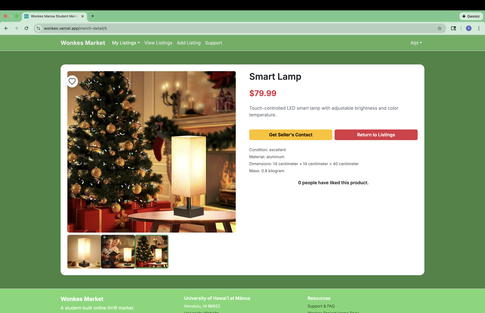
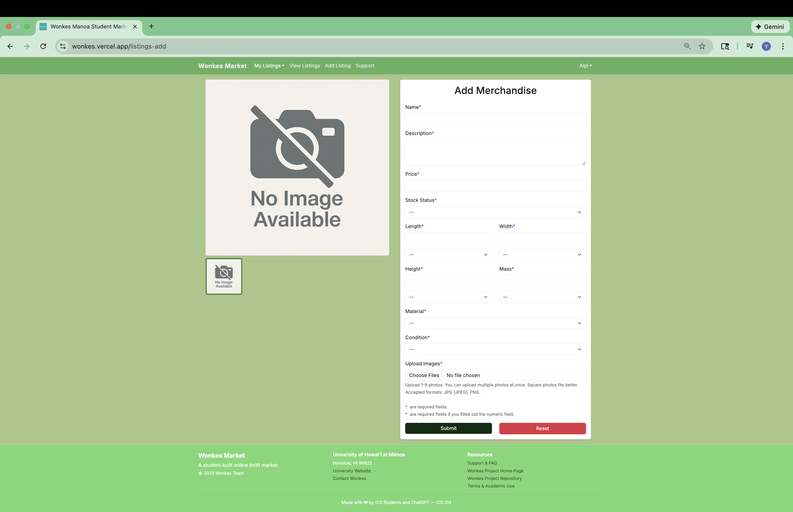

## Patterns in everyday life

Programmers also rely on patterns—some personal, some widely adopted—to create consistent, reliable results.

Many things we do in daily life follows some patterns that help us solve problems effectively. For example, a pattern for learning a new dish might be reading the recipe, following the recipe exactly to cook once, and finally adjusting the ingredients to match your taste. Similarly, a pattern for solving a chemistry problem might be gathering all the given quantities, identifying what to find, and lastly starting applying relevant theorems.

These patterns in common sense refer to a series of steps. However, the *pattern* in design patterns are much more complex idea than these.

## My personal workflow

As a newcomer to software engineering, I have not yet learn the official design patterns used in the industry. However, while working on my final project, Wonkes Market, I developed a workflow that helped me design pages with good user experience and manageable code:

1. What's the purpose of the page? Read the issue specifications and understand the requirements.
2. Is there already a nice UI design I can use as an inspiration? Let's go look for them on the internet!
3. How can this page split into possibly reusable components? Implement each component and put them together.
4. Where should this page and its components source data? Query the database themselves or take from the parameter? Probably the former for pages and the later for components.
5. Does this page require authentication? In any case, copy the code from a similar page, and modify as needed.
6. Don't want to spend time on just coding? Feed the issue and draft to ChatGPT and let it complete it.
7. Do code reviews, testings, try edge cases, and whatnot.
8. If good then done. Upload changes, close the GitHub issue, and composite reports as necessary.

Below is a screenshot of the merchandise detail page I implemented using this pattern.

The page displays the details of a merchandise. I got inspiration on the UI design from Amazon and eBay. The photo preview is one component, and the details are another component. The photo preview component is reused in the add merchandise page:

The merchandise detail page take input from the URL, and also fetch data from the database. Then the data is passed to the components as parameters. ChatGPT did tremendous of help on structuring the photo preview component and the details component. It turns out that the UI have a good appearance and is interactive, and the code is nice and neat.

## The real design pattern

Wikipedia's definition for design pattern is "a general, reusable solution to a commonly occurring problem in many contexts in software design." In other words, design pattern is a reusable solution to common problems in software design. Some well-known examples of design patterns includes,

* Factory pattern - managing object creation
* Observer pattern - automatic updates between related objects
* Decorator pattern - adding behavior without modifying code
* MVC pattern - separating data, UI, and logic

Design patterns are not simply steps of solving a problem, they are highly abstract solutions or a summary of how a solution should look like.

## Design patterns that *surprisingly* appeared in my project

While working on Wonkes Market, I did not intentionally apply design patterns in my work; I did not even know what are design patterns.

* UI elements in the project built from React components, and put together in a hierarchy shape. This resembles the composite pattern.
* Codes in the project can roughly divide into database model and actions, user views, and controllers. This resembles the MVC pattern.
* The `AuthOnly` and `GuestOnly` components in the project work as wrappers, making pages or components wrapped inside require sign in and require not sign in, respectively. This resembles the decorator pattern.

## Conclusion

As a result, design pattern does seems useful. Even if they appear in my project without me intentionally using them, they made my project having a nice code structure. As I continue learning, I do hope to learn more about design patterns.

References:
 
Composite pattern. *Wikipedia*. Retrieved December 3, 2025, from <a href="https://en.wikipedia.org/wiki/Composite_pattern">https://en.wikipedia.org/wiki/Composite_pattern</a>.
 
Decorator pattern. *Wikipedia*. Retrieved December 3, 2025, from <a href="https://en.wikipedia.org/wiki/Decorator_pattern">https://en.wikipedia.org/wiki/Decorator_pattern</a>.
 
Model-view-controller. *Wikipedia*. Retrieved December 3, 2025, from <a href="https://en.wikipedia.org/wiki/Model%E2%80%93view%E2%80%93controller">https://en.wikipedia.org/wiki/Model%E2%80%93view%E2%80%93controller</a>.
 
Software design pattern. *Wikipedia*. Retrieved December 3, 2025, from <a href="https://en.wikipedia.org/wiki/Software_design_pattern">https://en.wikipedia.org/wiki/Software_design_pattern</a>.

Note:
ChatGPT was used to help writing and editing this essay.
