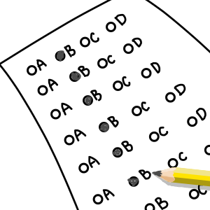

## Is there advantageous strategy for guessing the answer of a multiple choice problem?

Once upon a time, everyone in my English class were talking about preparing for exam, and they came up with this topic: when you got stuck on a series of multiple choice problems, and you decide to pick answers at random, is there any strategy that increase your chance of getting each problem right? The class discussed eagerly.&nbsp;&nbsp;Some says they simply choose an answer randomly for each problem, and some argues they have a higher chance compared to formal getting each problem correct by consistently selecting the same answer choice.&nbsp;&nbsp;As a person who interest in math, and since probability has something to do with math, I wondered if one of the two is an advantageous strategy.&nbsp;&nbsp;It turns out that the two ways gives an examinee same chance of getting a problem right, assuming each answer choice is equally likely being picked by the examinee, and is equally likely being the correct answer.

## The probability of being correct by picking an answer at random

Typically a multiple choice problem has 4 answer choices, and one of them is the correct answer.&nbsp;&nbsp;Some multiple choice problems has other number of answer choices, but the probability of getting them correct by picking an answer at random are calculated using the same way.&nbsp;&nbsp;We can make a generalized proof that apply to all of them.&nbsp;&nbsp;Let integer $n$ be the number of answers in one problem, where $n \geq 2$.&nbsp;&nbsp;We consider $n \geq 2$ because a multiple choice problem with less than two answer choices is illogical.&nbsp;&nbsp;Let $a_1, a_2, ..., a_n$ represent each answer choice.&nbsp;&nbsp;Let $s$ represent the answer chosen by an examinee, and $c$ represent the correct answer.

Notice that all possible outcome of $s$ and $c$ are equally likely to appear, because each answer choice is equally likely being picked by the examinee, and each answers choice is equally likely being the correct answer.&nbsp;&nbsp;Let $A$ be the event that $a_i$ is picked by the examinee, where integer $i$ take one value from range $\[1, n\]$.&nbsp;&nbsp;Since each answer choice is equally likely being picked by the examinee, the probability that $A$ happen, represented by $P(A)$, is $1 / n$.&nbsp;&nbsp;Similarly, let $B$ be the event that $a_j$ is the correct answer, where integer $j$ take one value from range $\[1, n\]$.&nbsp;&nbsp;Since each answer choice is equally likely being the correct answer, the probability that $B$ happen, represented by $P(B)$, is also $1 / n$.&nbsp;&nbsp;The probability that both $A$ and $B$ happen is $P(A) \times P(B) = 1 / n \times 1 / n = 1 / n^2$.&nbsp;&nbsp;This is important, because it means the probability that the examinee getting a problem right can be calculated by dividing the number of possible outcome of $s$ and $c$ that makes the examinee get the problem right by the number of possible outcome of $s$ and $c$.

Since the examinee can pick any one of the $n$ answer choices, and the correct answer can be one of the $n$ answer choices, the number of possible outcomes of $s$ and $c$ is $n \times n = n^2$.&nbsp;&nbsp;Moreover, the examinee gets the problem correct when $s = c$.&nbsp;&nbsp;Since there are $n$ possible answers, there are $n$ outcomes of $s$ and $c$ that satisfies $s = c$.&nbsp;&nbsp;Therefore the probability that the examinee get a problem right with this method is $n / n_2 = 1 / n$.

## The probability of being correct by consistently picking the same answer choice

When using the second method, which choice should be consistently pick is arbitrary: an examinee can pick any of the answer choice they wish.&nbsp;&nbsp;Suppose the examinee picked $a_i$, which means $s = a_i$.&nbsp;&nbsp;The examinee gets the problem right when $s = a_i = c$.&nbsp;&nbsp;Since any one of the $n$ answer choices is equally likely be the correct answer, the probability that $c = a_i$ is $1 / n$.&nbsp;&nbsp;Therefore the probability that the examinee get a problem right with this method is also $1 / n$.&nbsp;&nbsp;Comparing the result of the two methods, we know that none of the two methods is advantageous compared to the other, because they give an examinee the same probability of getting the problem right.

## The flaw in the feeling that first method is a disadvantage compared to the second method

One may suspect that the probability of getting a problem right using the first method is actually $1 / n^2$.&nbsp;&nbsp;Consider an arbitrary answer choice $a_i$.&nbsp;&nbsp;Since each of the $n$ answer choices is equally likely being picked by the examinee, the probability that the examinee picked $a_i$ is $1 / n$.&nbsp;&nbsp;Since each of the $n$ answer choices is equally likely being the correct answer, the probability that $a_i$ is the correct answer is $1 / n$.&nbsp;&nbsp;The probability that $a_i$ is being picked by the examinee and is the correct answer at the same time is $1 / n \times 1 / n = 1 / n^2$.&nbsp;&nbsp;Therefore the examinee get the problem right at a probability of $1 / n^2$.

This idea is flawed because it considers only one outcome of $s$ and $c$ that satisfy $s = c$, while there is a total of $n$ outcomes satisfying $s = c$.&nbsp;&nbsp;It is true that the probability of one specific answer choice being chosen by the examinee and being the correct answer is $1 / n^2$, but remember that examinee gets the problem right as long as $s = c$.&nbsp;&nbsp;Since there are $n$ answer choices that $s$ can take value of and $c$ can take value of, there are $n$ outcomes of $s$ and $c$ that satisfy $s = c$, where each outcome associate with different answer choice being $s$, and each outcome occur with probability of $1 / n^2$.&nbsp;&nbsp;The probability that one of these $n$ outcomes occur is $\sum_{k=1}^{n} 1 / n^2 = n \times 1 / n^2 = n / n^2 = 1 / n$.&nbsp;&nbsp;Which means the examinee can get the problem right with a probability of $1 / n$.

## Conclusion

As a result, both methods gives an examinee probability of $1 / n$ of getting a multiple choice problem of $n \geq 2$ answer choices right.&nbsp;&nbsp;There is no advantage of using one over another.&nbsp;&nbsp;Nevertheless, as the probability of hitting correctness with a randomly picked answer is not that high that one may rely on to pass a class, so study hard and eliminate answer choice that sound wrong may be a better way.
