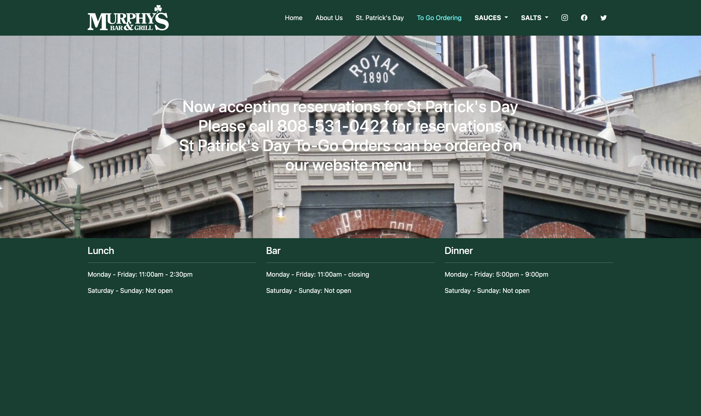

## How a user interface (UI) framework boosts development process

Metaphorically speaking, a UI framework is like instant noodles in culinary, the quadratic formula in algebra, or a camera in photography—someone has already done most of the hard work, and you can use their accomplishments as the starting point for your own project.

For example, Bootstrap 5 is a UI framework that contains a vast collection of prewritten CSS and JavaScript code. You can apply these components directly in your HTML to give your website a polished, professional appearance without reinventing the whole wheel.

Bootstrap 5 provides easy-to-use tools for margins, padding, borders, columns, rows, navigation bars, dropdown menus, just to name a few. With that said, let's see an image of the website I recreated using less than an hour with Bootstrap 5.

  

The original website is <a href="https://www.murphyshawaii.com/">Murphy's Bar & Grill</a>, which now looks quite different from the version I imitated.

## Investing time in learning a UI framework

As mentioned above, Bootstrap 5 includes a tremendous amount of CSS and JavaScript code. Of course, it takes time to understand what each CSS class does and how to use them effectively.

However, investmenting time in learning a UI framework quickly pays off. Once you become familiar with the framework, you can develop responsive, visually consistent webpages much faster than writing every line of CSS and JavaScript from scratch yourself.

## Conclusion

Bootstrap 5 is a powerful UI framework full of ready-to-use classes and scripts that can be applied directly in HTML. Although it takes some time to learn, it ultimately saves far more time in the long run and allows developers to focus on design, functionality, and creativity instead of repetitive styling details.

Note:
ChatGPT was used to help illustrating the image above and editing this essay.