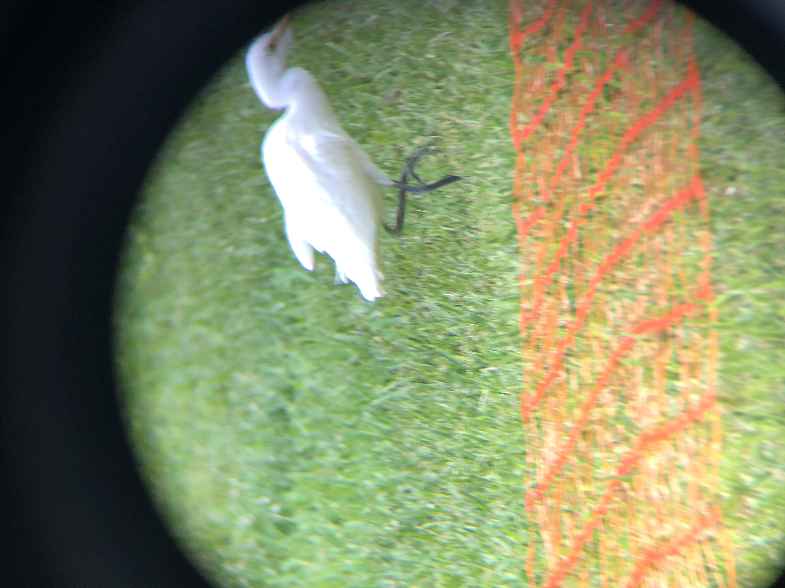
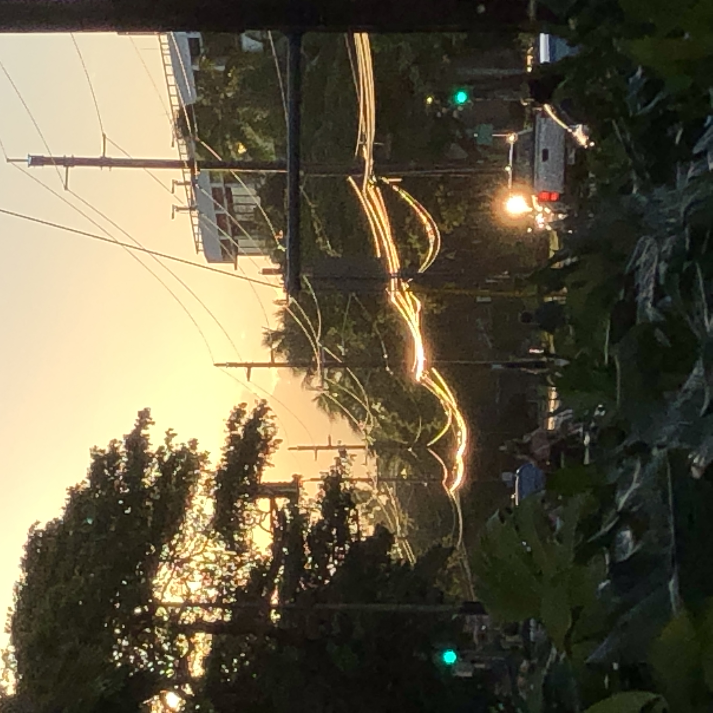
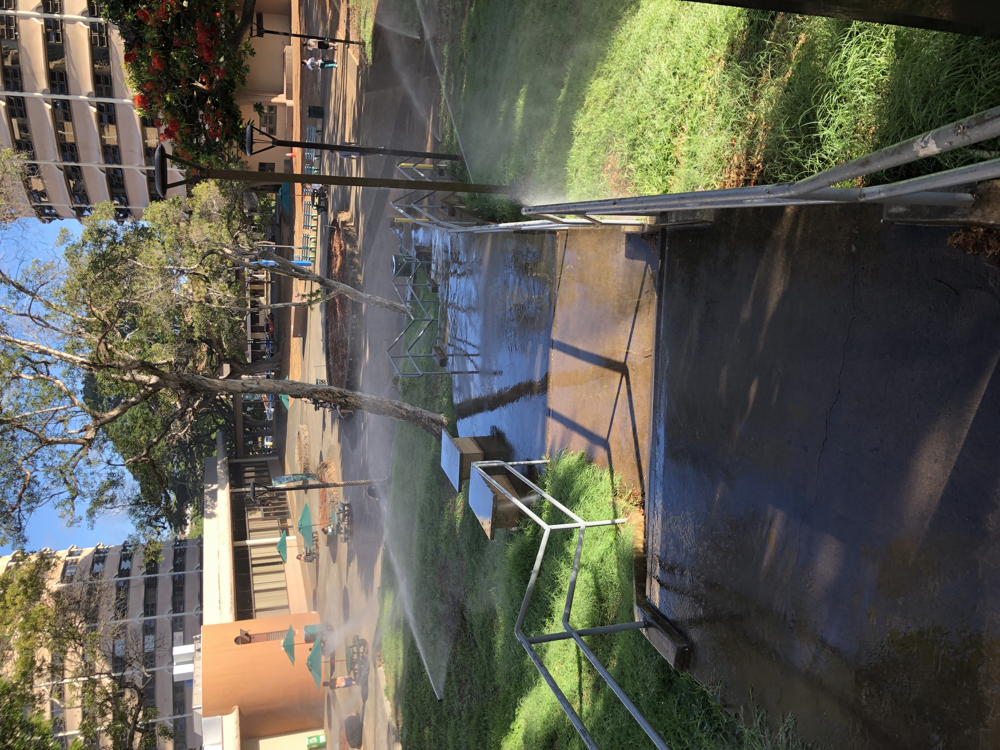
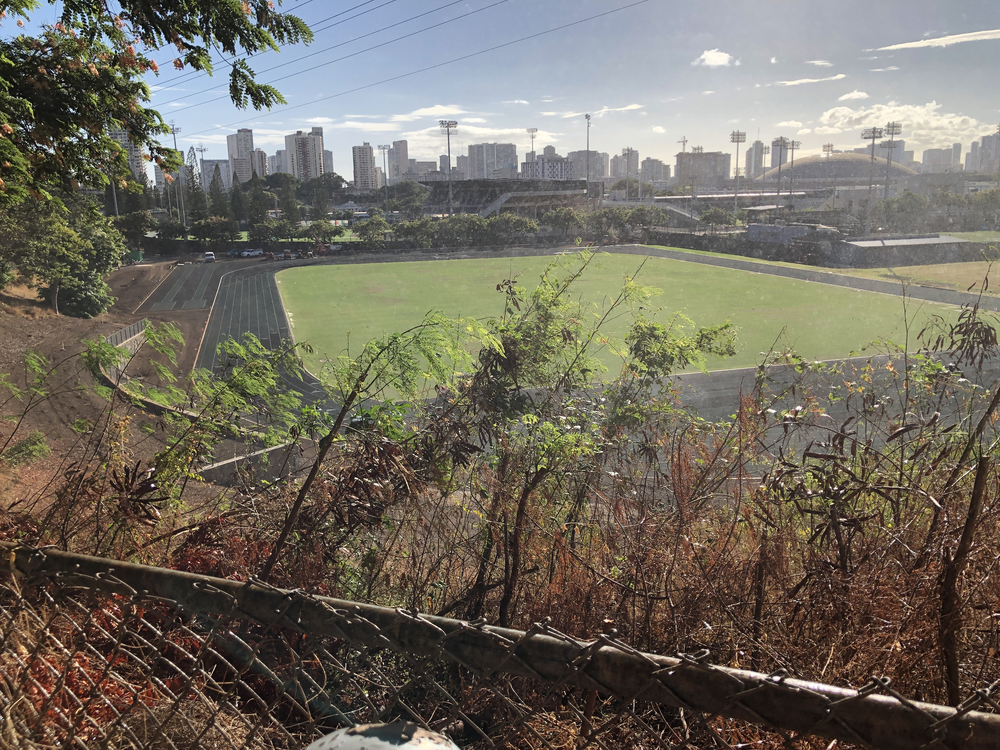
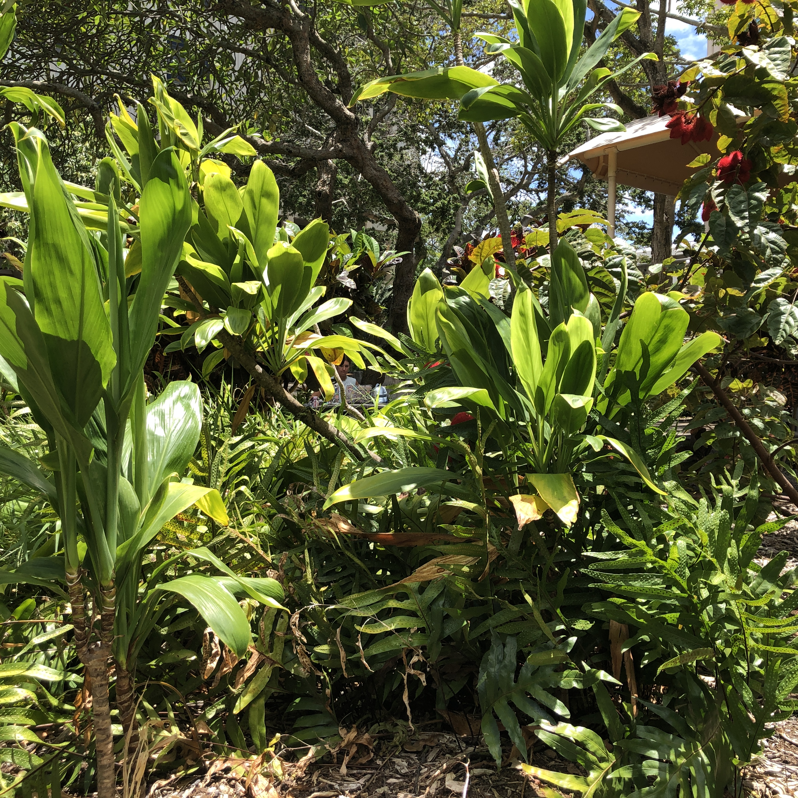
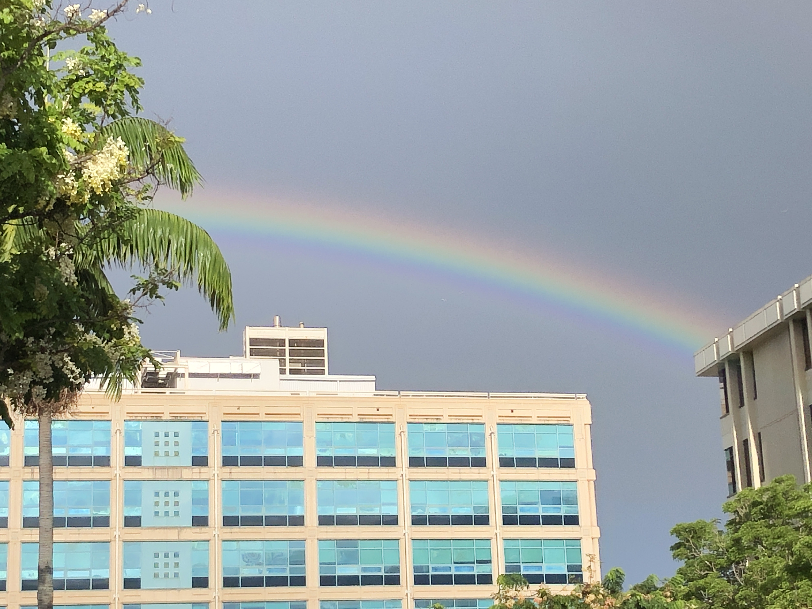
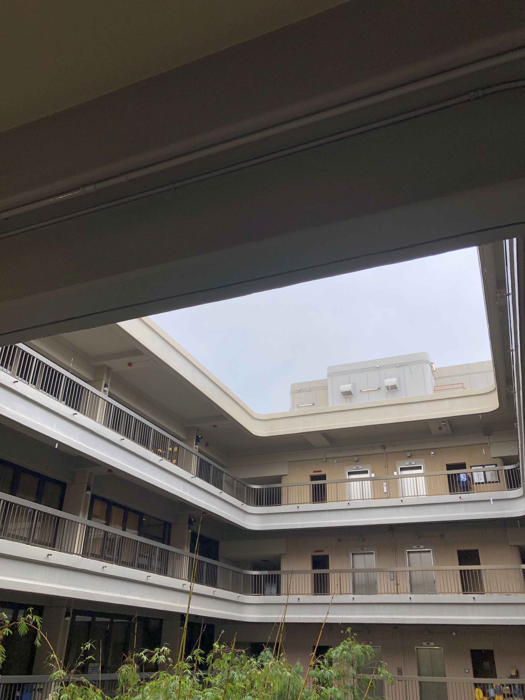
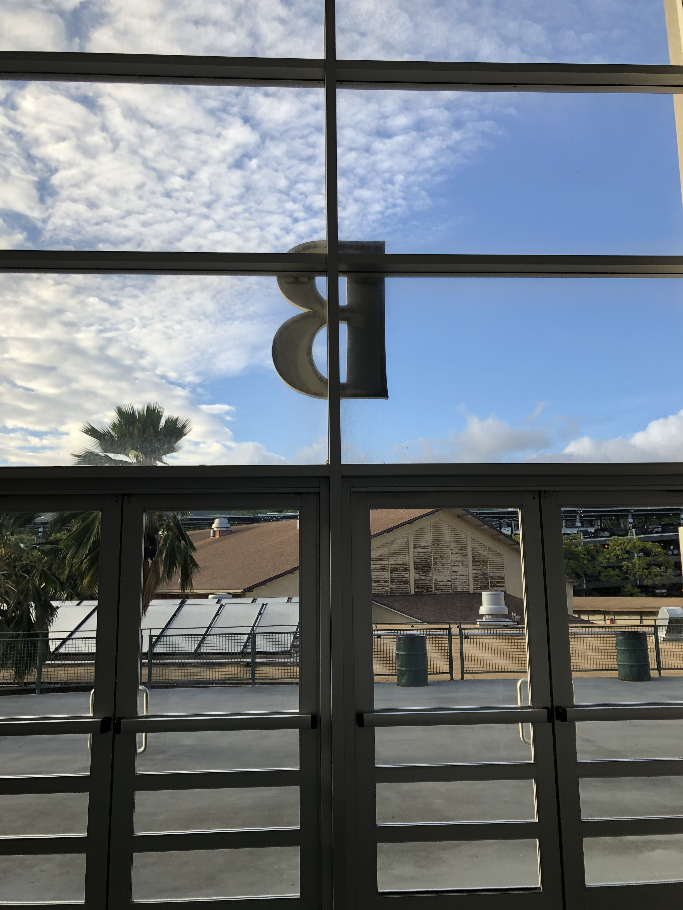
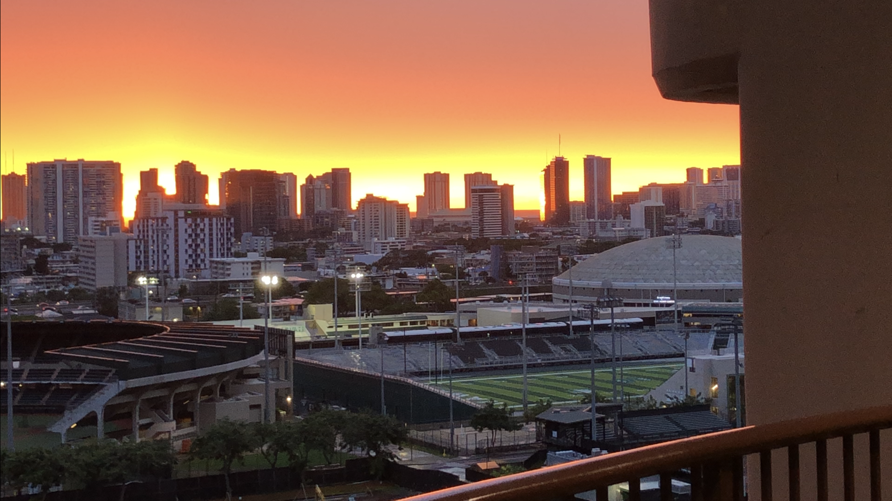

## Overview

The Manoa campus is filled with beautiful and interesting places, but many students miss them because their classes take place within a small area of campus.

    
    
    
    
    
    
    
    
    

**Problem:** Many scenic spots on the Manoa campus go unnoticed.  
**Solution:** *Diamond Matrix: Manoa* is a treasure-hunt style web game that highlights interesting or beautiful campus locations on a map, encouraging students to visit them in person. By exploring these locations, players experience the variety of landscapes across the Manoa campus.

Locations requiring restricted access, such as dorms, are excluded. Below is a sunset view from the Hale Aloha Tower dorm lounge, floor 11.

    

## Names of the proposers

Yuhang proposed this project. The name *Diamond Matrix* came to mind during daydreaming and was refined to *Diamond Matrix: Manoa* for this project. The idea of the gameplay came from a side mission in *Grand Theft Auto: San Andreas*, where the player photograph 50 different locations around San Fierro, and sees beautiful landscapes in the meantime.

## Mockup page ideas

The first draft of the website is outlined hierarchically:

* Homepage
* Create Account
* Account Log In
    * Player
        * Map
            * Enter Passcode
        * Achievements
        * Rankings
        * Account Settings
    * Administrator
        * Map
            * Enter Passcode
        * Achievements
        * Rankings
        * Account Settings
        * All Account Summary
            * Modify Account Form

The **Homepage** is the landing page.
New users can sign up on the **Create Account** page.  
Registered users log in through the **Account Log In** page, where they can access one of two account types: *Player* or *Administrator*. All newly created accounts are player accounts by default.

### Player Account Features

Players can view a **Map** of the Manoa campus with four active markers. Each marker represents an unexplored location. Clicking a marker opens the **Enter Passcode** page, where the player enters a passcode found on-site to prove that they have visited the location. Once entered, the corresponding marker disappears and a new one unlocks. There will be about 50–70 locations in total.

Players can review their explored sites on the **Achievements** page, which lists each location with a photo and brief description.  
They can also visit the **Rankings** page to see who has completed all locations. Rankings are listed by completion time in chronological order, not how fast the game is passed, since the game emphasizes exploration over competition.  

Players can choose to hide their name from the rankings via **Account Settings** page.

### Administrator Account Features

Administrators have all player features plus access to the **All Account Summary** page, where they can view and manage all user accounts. They can modify or delete accounts using the **Modify Account Form**, and change user privileges between player and administrator.

The first draft of the relational database structure for <i>Diamond Matrix: Manoa</i> is shown below, where each item is a table name, and each subitem is a column name.

## Database structure ideas

A preliminary relational database schema for *Diamond Matrix: Manoa*:

* `Account`
    * `AccountID`
    * `Privilege`
    * `CreationTime`
    * `Username`
    * `Password`
* `UserInfo`
    * `AccountID`
    * `FirstName`
    * `MiddleName`
    * `LastName`
    * `WhatsUpMessage`
* `AccountSetting`
    * `AccountID`
    * `Language`
    * `Theme`
    * `JoinRanking`
* `Location`
    * `LocationID`
    * `XCoordinate`
    * `YCoordinate`
    * `Name`
    * `PhotographURL`
    * `Description`
    * `OpenWeekDay`
    * `OpenTime`
    * `CloseTime`
    * `FloorNumber`
    * `Hint`
* `Achievement`
    * `AccountID`
    * `LocationID`
    * `UnlockTime`
    * `AchieveTime`
* `Language`
    * `English`
    * `Hawaiian`
    * `Tagalog`
    * `SimplifiedChinese`
    * `...`

The `Account`, `UserInfo`, and `AccountSetting` tables are linked by `AccountID` and stores user-specific data.  
`Location` stores information for each marker on the map.  
`Achievement` tracks the progress of each user at each location.  
`Language` contains site-wide dialogue translations, with each column representing a language.

## Use case ideas

Below are some use case examples.

* A new player creates an account, logs in, views the map, and visits a marked location. They find a hidden passcode after looking around, enter it, and unlock a new location.  
* An administrator logs in, opens the **All Account Summary** page, selects an account, upgrades it to administrator status, and logs out.  
* A player completes the final location, appears on the **Rankings** page, reviews all visited locations on the **Achievements** page, and then disables public ranking visibility in **Account Settings**.

## Beyond the basics

Additional planned features include:

* **Time-based availability:** Some campus locations close at night or on weekends. The `OpenWeekDay`, `OpenTime`, and `CloseTime` fields can store accessible hour information for each location. A user will be able to see when is a location available for visiting.  
* **Search hints:** For tall buildings or multi-floor areas, the `FloorNumber` and `Hint` fields can store helpful information for players to narrow their search.  
* **Multilingual support:** Players can select their preferred language in **Account Settings**, with content dynamically translated from the `Language` table.

Note:
ChatGPT was used to help editing this essay.

Author:
Yuhang Wu
