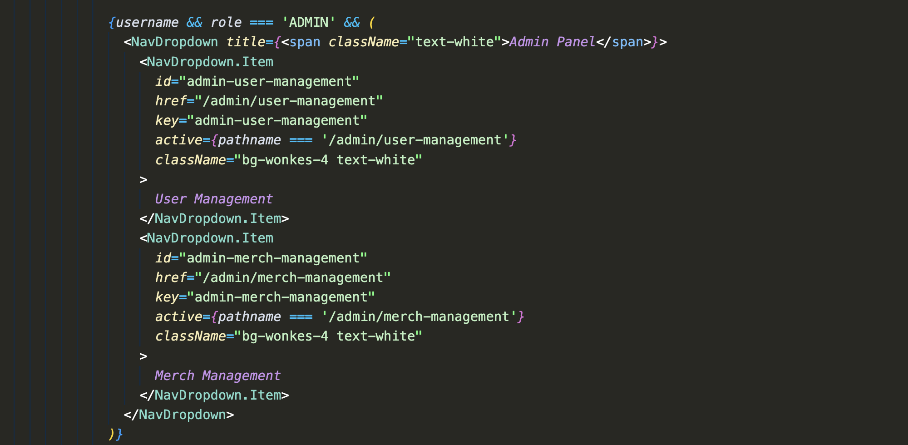
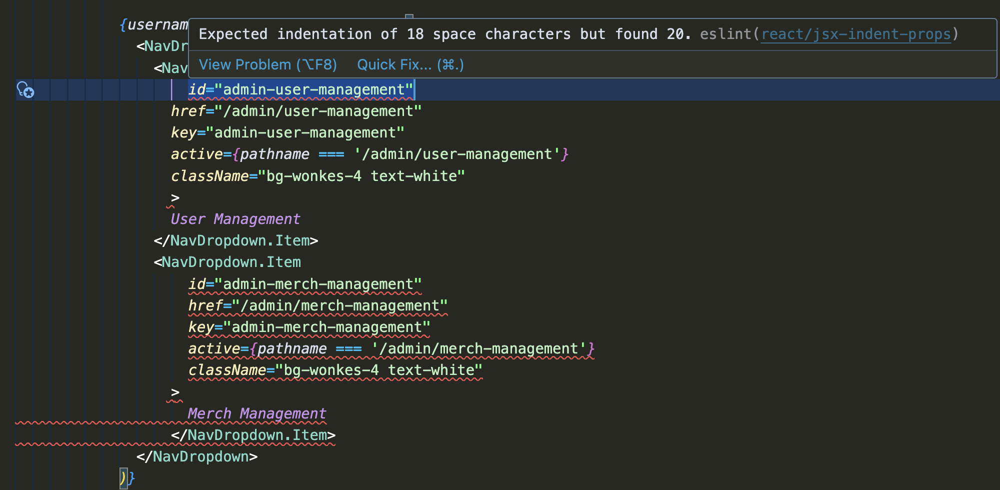

## What is software engineering?

If you split the phrase "software engineering" and look each up in a dictionary, then the definition for "software" is a program used by computer and "engineering" is a science and technology involving designing, building, and using engines, machines, and structures. Combining the two definitions, software engineering is a science involving designing, building, and using programs used by computers.

This is exactly what I thought is software engineering, and in fact, that is exactly what is software engineering. Examples of software engineering includes designing and setting up a website, designing and create an application for a phone, designing and implement an executable on a computer, etc.

## My software engineering class

My first software engineering class is referred as ICS 314 by my college. There are many fundamental concepts of software engineering that I learned in this class:

* Open source software development
* Configuration management
* Functional programming
* Development environments
* Coding standards
* User interface frameworks
* Agile project management
* Design patterns
* Ethics in software engineering

Let's pick user interface frameworks and coding standards and to talk about in this essay.

## User interface frameworks

To understand what is an user interface framework, it is crucial to know what is an user interface and what is a framework

An user interface is a page or panel where users can do operations. For example, the screen, buttons, and knobs on a stove is an user interface where users operate it to heap stove, preheat oven, etc. Another example would be the sign in page of a banking application on a phone, where users input their credentials to sign in to their online bank account.

A framework is a pack of pre-written code where programmers can write their program upon. For example, Bootstrap 5 is a well-known framework that contains a bunch of CSS code and JavaScript code that which specifies the appearance of many web elements, such as buttons, input fields, drop-down menus. With Bootstrap 5, a programmer can create a nice webpage by writing HTML and uses the styles specified by Bootstrap 5 codes. The existence of a framework allows a programmer to build their project without writing all code from scratch, and speeds up the development speed. In essence, a framework are codes that one can start their project with.

An user interface framework are frameworks that are specifically for building consistent and beautiful user interfaces for websites and applications. One user interface framework I learned in ICS 314 is React.

## Coding standards

A coding standard is a set of rules a programmer has to obey while writing code. A coding standard is different from a programming language's syntax, for which the program can not compile if wrong; the purpose of enforcing coding standard is typically to make all code of a project in similar format, which makes future code-review and changing more easy.

Different coding standard may require different things, even for the same programming language. For example, one codding language may require squiggly brackets to occupy the same line as function signature or header, and output the code like this:

```
function sum(arr : number[]) : number {
  let sum = 0;
  for (let index = 0; index < arr.length; index++) {
    sum += arr[index];
  }
  return sum;
}
```

While another coding standard may ask squiggly brackets to always occupy a single line:

```
function sum(arr : number[]) : number
{
  let sum = 0;
  for (let index = 0; index < arr.length; index++)
  {
    sum += arr[index];
  }
  return sum;
}
```

One may wonder if a coding standard can be strictly enforced. There is actually program for checking if a piece of code obeys a coding standard, such as the ESLint that I used in my team final project [Wonkes](https://wonkes-manoa.github.io/).




When there is violation of the coding standard that we configured, the code conducting the violation will be marked as ESLint error and underlined with red squiggly line. The reason of violation is explained upon mouse hover. Upon now it is just a notice to the programmer that their code violates the coding standard, the real thing that forced us to obey to the coding standard is that we configured our GitHub repository to reject code that violates the coding standard. In other words, we can not submit code with coding standard violation successfully, thus forced us to fix all violations before submission.

It turns out that under such restriction, code written by different teammates have similar style, which benefits when we read another teammate's code. For example, I did not felt much stress while reading another teammate's code because the style of the code are similar.

## Conclusion

In brief, software engineering is a science involving design, build, and use of computer programs. There is many concepts in software engineering. Two of which is user interface framework, which helps developing user interface, and coding standard, which enforce same code style for better readability.
