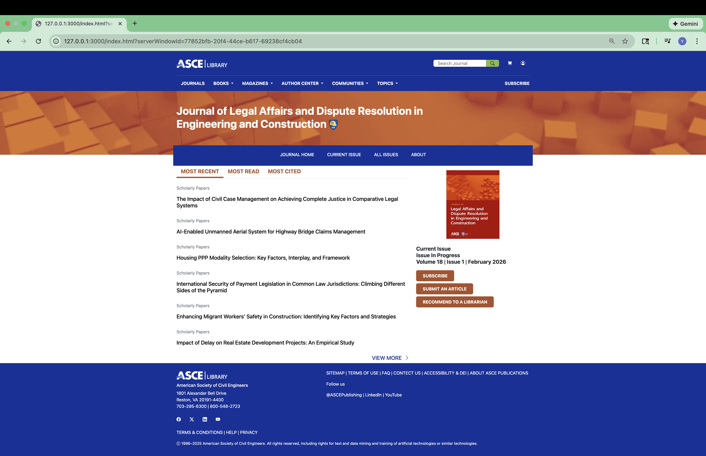
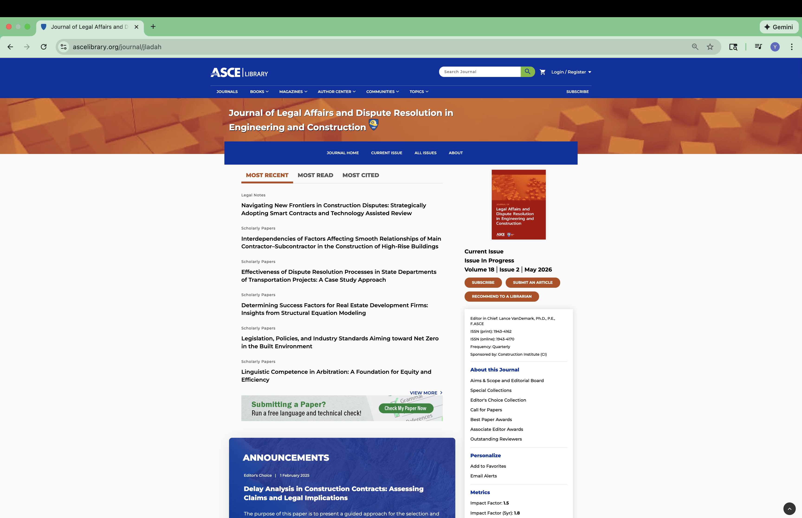

## What is software engineering?

If we split the phrase software engineering and look up each word in a dictionary, software is defined as a program used by a computer, and engineering is the science and technology involved in designing, building, and using engines, machines, and structures. By combining these two definitions, software engineering can be understood as a science that involves designing, building, and using computer programs. Based on this definition, software engineering is not just about writing code, it is also about planning a good structure for the program for long-term maintainability.

This definition closely matches my original understanding of software engineering, and in fact, it accurately describes the field. Examples of software engineering include designing and setting up a website, designing and creating an application for a phone, and designing and implementing an executable program on a computer. All of these tasks require thoughtful design, considerations, and decisions, so the program fits the users' needs and is easy to update or expand in the future.

## My software engineering class

My first software engineering class is referred to as ICS 314 by my college. In this class, I learned many fundamental concepts related to software engineering that go beyond just writing code:

* Open source software development
* Configuration management
* Functional programming
* Development environments
* Coding standards
* User interface frameworks
* Agile project management
* Design patterns
* Ethics in software engineering

These concepts are about, technical knowledge, teamwork, project management and organization, and ethical responsibility in software development. These topics made me realized how real-world software engineering is more complicated than I ever imagined. In this essay, I'll focus on two of these topics: user interface frameworks and coding standards.

## User interface frameworks

To understand what a user interface framework is, it is important to first understand what a user interface and a framework are.

A user interface is a page or panel where users can perform operations and interact with a system. For example, the screen, buttons, and knobs on a stove form a user interface that allows users to heat the stove or preheat the oven. A well-designed stove interface makes these actions intuitive and safe. Another example is the sign-in page of a banking application on a phone, where users input their credentials to access their online bank account. In this case, the user interface must be both easy to use and secure.

A framework is a collection of pre-written code that programmers can build upon instead of starting their project from nothing. For example, Bootstrap 5 is a well-known framework that contains a large amount of CSS and JavaScript code specifying the appearance of many web elements, such as buttons, input fields, and drop-down menus. With Bootstrap 5, a programmer can create a visually appealing webpage by writing HTML and applying styles already defined by the framework. The pictures below show a comparison between the website I imitated using Bootstrap 5 (left) and the [real website](https://ascelibrary.org/journal/jladah) (right), demonstrating how closely a framework can reproduce a beautiful and professional design.

<style>
    .image-gallery {
    display: flex;
    flex-wrap: wrap;
    gap: 0.5rem;
    margin-bottom: 1rem;
    }
    .image-gallery img {
    width: 405px;
    height: auto;
    object-fit: cover;      /* Crop instead of stretch */
    border-radius: 0.5rem;  /* Rounded corners all around */
    }
</style>

<div class="image-gallery">
    
    
</div>

The existence of a framework allows programmers to avoid writing everything from scratch and significantly speeds up development. It also helps maintain consistency across pages and reduces the likelihood of design errors. In essence, a framework provides a nice and strong starting foundation for a project and allows developers to focus more on functionalities specific to their project rather than building the basics.

A user interface framework is a framework specifically designed for building consistent and visually appealing user interfaces for websites and applications. One user interface framework I learned in ICS 314 is called [React](https://react.dev/). React encourages developers to break interfaces into reusable components, which makes more code reusable, and makes large projects easier to manage and update.

I can see myself building websites and software in the future using user interface frameworks because of their convenience and efficiency. In fact, the organization I work for has planned to reimplement their website using frameworks like React and Next.js because they are modern and convenient.

## Coding standards

A coding standard is a set of rules that programmers must follow when writing code. Coding standards are different from a programming language's syntax rules. While syntax errors prevent a program from successfully compiling or executing, violations of coding standards do not usually stop a program from running. Instead, coding standards exist to ensure that all code in a project follows a similar format and structure, which is especially important when a team of multiple people work on the same codebase, because each teammate can easily read other teammates' code.

Different coding standards can impose different rules, even for the same programming language. For example, one coding standard may require curly braces to appear on the same line as the function declaration:

```
function sum(arr : number[]) : number {
  let sum = 0;
  for (let index = 0; index < arr.length; index++) {
    sum += arr[index];
  }
  return sum;
}
```

Another coding standard may require curly braces to always be placed on their own line:

```
function sum(arr : number[]) : number
{
  let sum = 0;
  for (let index = 0; index < arr.length; index++)
  {
    sum += arr[index];
  }
  return sum;
}
```

One might wonder whether coding standards can be strictly enforced. In practice, there are programs that automatically check whether code follows a coding standard. One example is ESLint, which I used in my software engineering class's final project, [Wonkes](https://mike-yuhang-wu.github.io/projects/wonkes.html).


My Visual Studio Code is configured so that when there is a violation of the configured coding standard, the code responsible for the violation is marked as an ESLint error and underlined with a red squiggly line. The reason for the violation is explained when the programmer hovers the mouse over the error. While this initially serves as a warning, the real enforcement comes from our GitHub repository configuration. The repository was set up to reject any code submissions that violated the coding standard, forcing us to fix all violations before successfully submitting our code.

Although this constraint on coding standard enforcement blocked a few teammates' update for a few hours, while they correct their code. Nevertheless that under these restrictions, code written by different teammates ended up having a very similar style. This consistency made reading other teammates' code much easier and reduced confusion when one reviews another's code. For example, I did not feel much stress when reading another teammate's code because the formatting and structure were familiar and predictable.

I can see myself using coding standards in future projects and professional jobs because they make code easier to read, maintain, and improve over time.

## Conclusion

In brief, software engineering is a science that involves the design, construction, and use of computer programs. It includes many important concepts that go beyond basic programming. Two of these concepts are user interface frameworks that help developers efficiently build appealing and user-friendly user interfaces, and coding standards that enforce consistent code style to improve readability and ease collaboration. These ideas together show how software engineering supports both good technical quality, thoughtful planning, and easy but efficient teamwork in real-world projects.
