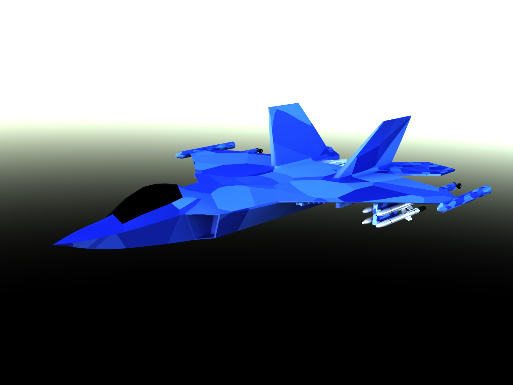
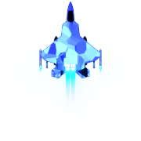
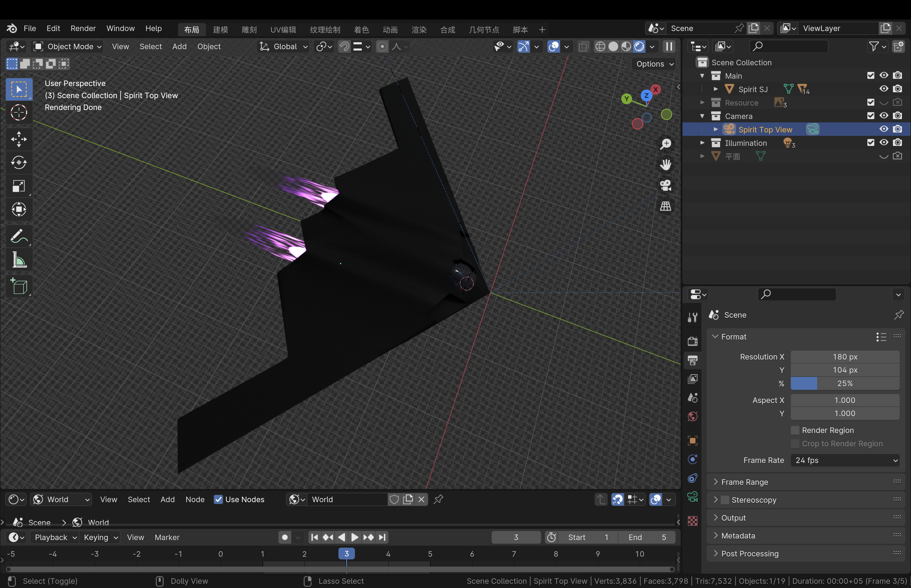
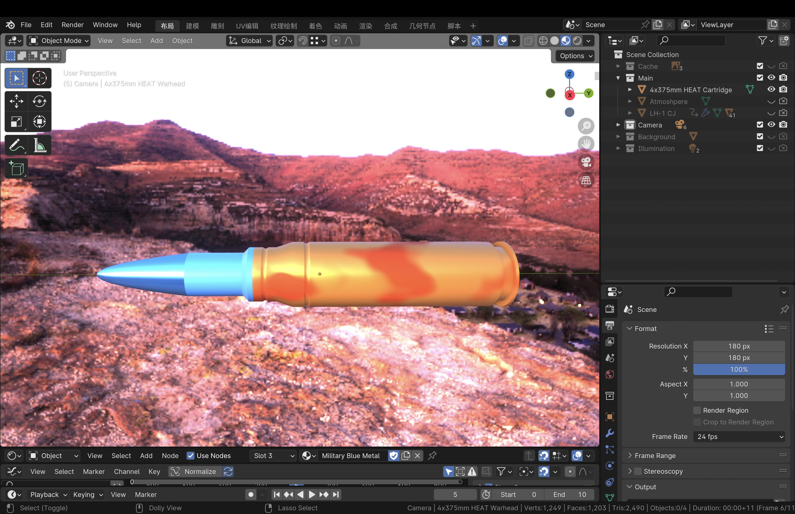

Have you ever wonder how would a game be like if it was developed with C and C++ by someone who knows nothing about pointers, objects, and all that stuff? Today you would see one here!

In summer 2023, when I was a programming beginner who just learned a little about Python and HTML, I was inspired to create a small game with C and C++, as I saw a tutorial video on Bilibili teaching how. This is a game where you would control a jet in a space background and shoot down whatever appear in front of you. According to this gameplay, I named this game Space Shooter.

Although I didn't complete the whole game before school starts, and I likely wouldn't continue with it in the future, there were stuffs about it worth sharing.

Before getting into what I done and learned, let's watch a short <a href="../img/space-shooter/space-shooter-gameplay-demo-part-1.mp4">demonstration video</a> showing me playing this game.

## Main Loop of the Game

Below is the main function of the game that calls all necessary functions to make Space Shooter a game.

```

int main() {
	loadImageToPointers();

	initializeHero();

	drawGraphicWindow();
	drawStarrySky(110);
	getAndSaveBackground();

	BeginBatchDraw();
	while (true) {
		redrawBackground();
		drawAndPilotHero();
		drawAndMoveSpirit();
		warheadBallistics();

		FlushBatchDraw();
	}
	EndBatchDraw();

	return 0;
}

```

In brief, all this main function did is calling appropriate functions sequentially to:
1. Prepare all images, including images of the jet that player control, and the jet that player shoot.
2. Initial attribute those jets have, such as their initial velocity.
3. Draw a background image featuring space. Save it for later use.
4. While the game is not ending, draw background, draw jets, draw stuff that players shot, show those to the player by putting them on the graphic window, and repeat this step.

As you can imagine, Space Shooter is a jet fighting game so it should have jets. One thing I had to do was preparing some jet images, as well as images of other elements of this game.

## Preparing game elements

I searched the web for some jet image, and I didn't like any of them. Therefore I decide pull out the jet model I made with Blender in the past. After adding a little rockets on it, it finally have some appearance of a space ship that plays well with the background of the game.

<div style="display: inline-block;">
  
  
  
</div>

This jet is handsome, so I decided to let it be the one that the player controls.

<br/>
<div style="display: inline-block;">
  
  
</div>

I need at least one more for enemy jet, and here it is. The same thing was done for bullets.

<br/>
<div style="display: inline-block;">
  
</div>

## Graphics for background

If you were to play a game in modern day, you were not likely playing one on a console or terminal that displays only text. A window that displays image is required to show more stuff than that. For implementing graphics for Space Shooter, I utilized EasyX, a graphic library providing an easy way to create a graphic window and manipulate what to show within it, including simple geometries and images.

For the background of the game, I decided to use a pure deep blue color with tremendous little white circular dots of random diameter as the background, which features a starry sky. The function `drawStarrySky` below draws `numberOfStarsToDraw + 1` stars on the graphic window. Why `numberOfStarsToDraw + 1` stars? Because I miscounted the number of times the code in the loop executes.

```

// 生成图形窗口的背景图像。背景图像：宇宙中的星空
void drawStarrySky(int numberOfStarsToDraw) {
	// 用深蓝色做为背景。RGB(28, 32, 163) or RGB(2, 25, 63)
	setbkcolor(RGB(2, 25, 63));
	// setbkcolor(BLACK);
	cleardevice();

	// 在图形窗口上的随机位置生成随机大小的白色填充的圆形来做星星。
	setfillcolor(WHITE);
	seadRandomNumberGenerator();
	for (short C = 0; C <= numberOfStarsToDraw; C++) {
		fillcircle(getRandomIntegerInRange(0, graphicWindowWidth), getRandomIntegerInRange(0, graphicWindowHeight), getRandomIntegerInRange(1, 3));
	}
}

```

Note: All source code of this project came with comment in Chinese. I would not translate them to English, to show what was originally in the source code.

## Graphics for images

The next thing to achieve was to put an image into the graphic window. Unfortunately, the `putimage` function provided by EasyX that puts an image into graphic window does not exactly satisfy the needs here. After putting the image below into the graphic window, the jet in the image was appeared to be surrounded by a black rectangle, when its surroundings were supposed to show the background.

<div style="display: inline-block;">
  
</div>

Since the image is in PNG format, and the output setting for color in Blender was set to RGBA, there should be an alpha channel value for each pixel in the image denoting how transparent the pixel is. With that information, I wrote the algorithm below that creates a new image by mixing the color of the pixel of source image (the image to put into graphic window) and the "screenshot" of the area on the graphic window to put the source image, with the alpha channel values from the source image as coefficient.

```

void drawImageAsRGBA(IMAGE* sourceImage, double imagePositionX, double imagePositionY) {
	// 获取原图的尺寸。
	int sourceImageWidth = sourceImage->getwidth();
	int sourceImageHeight = sourceImage->getheight();

	// 截取原图将要覆盖的区域的图像。
	IMAGE areaToCover;
	getimage(&areaToCover, (int) imagePositionX, (int) imagePositionY, sourceImageWidth, sourceImageHeight);

	// 获取原图和原图将要覆盖的区域的图像的缓冲区数组指针。
	DWORD *sourceImagePixel = GetImageBuffer(sourceImage);
	DWORD *areaToCoverPixel = GetImageBuffer(&areaToCover);

	// 把原图像素与原图将要覆盖的区域的图像对应的像素进行透明度叠加。
	for (int sourceImageLocalAxisY = 0; sourceImageLocalAxisY < sourceImageHeight; sourceImageLocalAxisY++) {
		for (int sourceImageLocalAxisX = 0; sourceImageLocalAxisX < sourceImageWidth; sourceImageLocalAxisX++) {
			// 获取原图的像素的每个色彩通道的值。
			double sourceImageRedChannel = (UCHAR)(sourceImagePixel[sourceImageWidth * sourceImageLocalAxisY + sourceImageLocalAxisX] >> 0);
			double sourceImageGreenChannel = (UCHAR)(sourceImagePixel[sourceImageWidth * sourceImageLocalAxisY + sourceImageLocalAxisX] >> 8);
			double sourceImageBlueChannel = (UCHAR)(sourceImagePixel[sourceImageWidth * sourceImageLocalAxisY + sourceImageLocalAxisX] >> 16);
			double sourceImageAlphaChannel = (UCHAR)(sourceImagePixel[sourceImageWidth * sourceImageLocalAxisY + sourceImageLocalAxisX] >> 24);

			// 获取原图将要覆盖的区域的像素的每个色彩通道的值。
			double areaToCoverRedChannel = (UCHAR)(areaToCoverPixel[sourceImageWidth * sourceImageLocalAxisY + sourceImageLocalAxisX] >> 0);
			double areaToCoverGreenChannel = (UCHAR)(areaToCoverPixel[sourceImageWidth * sourceImageLocalAxisY + sourceImageLocalAxisX] >> 8);
			double areaToCoverBlueChannel = (UCHAR)(areaToCoverPixel[sourceImageWidth * sourceImageLocalAxisY + sourceImageLocalAxisX] >> 16);
			double areaToCoverAlphaChannel = (UCHAR)(areaToCoverPixel[sourceImageWidth * sourceImageLocalAxisY + sourceImageLocalAxisX] >> 24);

			// 调试时用于确认程序有获取到原图将要覆盖的区域的像素的颜色。
			/*
			if (sourceImageLocalAxisY == 0 and sourceImageLocalAxisY == 0) {
				setbkcolor(GREEN);
				cleardevice();
			}
			*/

			// 通过算法使用原图的Alpha通道的值为系数混合原图的彩色像素的每个色彩通道的值和当前图形窗口对应原图像素的像素的每个色彩通道的值。0.00392156862 = 1 / 255
			double destinateImageRedChannel = areaToCoverRedChannel + (sourceImageAlphaChannel / 255) * (sourceImageRedChannel - areaToCoverRedChannel);
			double destinateImageGreenChannel = areaToCoverGreenChannel + (sourceImageAlphaChannel / 255) * (sourceImageGreenChannel - areaToCoverGreenChannel);
			double destinateImageBlueChannel = areaToCoverBlueChannel + (sourceImageAlphaChannel / 255) * (sourceImageBlueChannel - areaToCoverBlueChannel);

			// UCHAR destinateImageRedChannel = sourceImageRedChannel * (sourceImageAlphaChannel * 0.00392156862) + (1 - sourceImageAlphaChannel / 255) * areaToCoverRedChannel;
			// UCHAR destinateImageGreenChannel = sourceImageGreenChannel * (sourceImageAlphaChannel * 0.00392156862) + (1 - sourceImageAlphaChannel / 255) * areaToCoverGreenChannel;
			// UCHAR destinateImageBlueChannel = sourceImageBlueChannel * (sourceImageAlphaChannel * 0.00392156862) + (1 - sourceImageAlphaChannel / 255) * areaToCoverBlueChannel;

			// 显示生成的图像。这个图像不是真正的RGBA图像，而是RGB图像，它只是以原图的Alpha通道的值为系数混合原图像素和背景像素来模拟RGBA图像的效果。
			putpixel((int) imagePositionX + sourceImageLocalAxisX, (int) imagePositionY + sourceImageLocalAxisY, RGB(destinateImageBlueChannel, destinateImageGreenChannel, destinateImageRedChannel));
		}
	}
}

```

To make those images appear moving on the graphic window, the whole window was in a loop of put background on, put image on, put background on, put image on, and so on. The location where the image would appear on the graphic window was decide by another part of the source code, which responds to player controls and the automatic spawning and moving of the enemy jets.

More details of this project to be updated.

Source: <a href="https://github.com/mike-yuhang-wu/space-shooter"><i class="large github icon "></i>mike-yuhang-wu/space-shooter</a>
