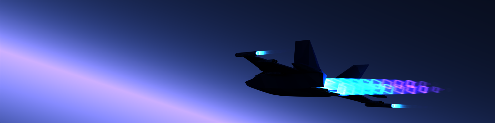
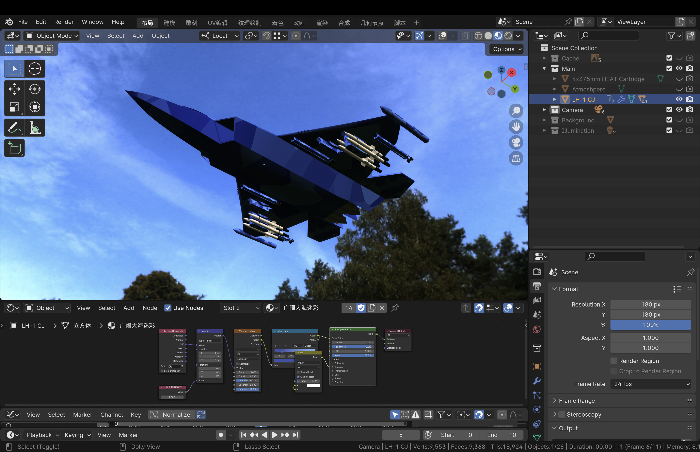

Have you ever wonder how would a game be like if it was developed with C and C++ by someone who knows nothing about pointers, objects, and all that stuff? Today you would see one here!

In summer 2023, when I was a programming beginner who just learned a little about Python and HTML, I was inspired to create a small game with C and C++, as I saw a tutorial video on Bilibili teaching how. This is a game where you would control a jet in a space background and shoot down whatever appear in front of you. According to this gameplay, I named this game Space Shooter.

Although I didn't complete the whole game before school starts, and I likely wouldn't continue with it in the future, there were stuffs about it worth sharing.

Before getting into what I done and learned, let's watch a short <a href="../img/space-shooter/space-shooter-gameplay-demo-part-1.mp4">demonstration video</a> showing me playing this game.

## Main Loop of the Game

Below is the main function of the game that calls all neccessary functions to make Space Shooter a game.

```
int main() {
	loadImageToPointers();

	initializeHero();

	drawGraphicWindow();
	drawStarrySky(110);
	getAndSaveBackground();

	BeginBatchDraw();
	while (true) {
		redrawBackground();
		drawAndPilotHero();
		drawAndMoveSpirit();
		warheadBallistics();

		FlushBatchDraw();
	}
	EndBatchDraw();

	return 0;
}
```

In brief, all this main function did is calling appropriate functions sequencially to:
1. Prepare all images, including images of the jet that player control, and the jet that player shoot.
2. Initial attribute those jets have, such as their initial velocity.
3. Draw a background image featuring space. Save it for later use.
4. While the game is not ending, draw background, draw jets, draw stuff that players shot, show those to the player by putting them on the graphic window, and repeat this step.

As you can imagine, Space Shooter is a jet fighting game so it should have jets. One thing I had to do was preparing some jet images, as well as images of other elements of this game.

## Preparing Game Elements

I searched the web for some jet image, and I didn't like any of them. Therefore I decide pull out the jet model I made with Blender in the past. After adding a little rockets on it, it finally have some appearance of a space ship that plays well with the background of the game.



## Graphics

If you were to play a game in modern day, you were not likely playing one on a console or terminal that displays only text. A window that displays image is required to show more stuff than that. For implementing graphics for Space Shooter, I utilized EasyX, a graphic library providing an easy way to create a graphic window and manipulate what to show within it, including simple geometries and images.

Source: <a href="https://github.com/mike-yuhang-wu/space-shooter"><i class="large github icon "></i>mike-yuhang-wu/space-shooter</a>
