## Wonkes' Birth

<!-- 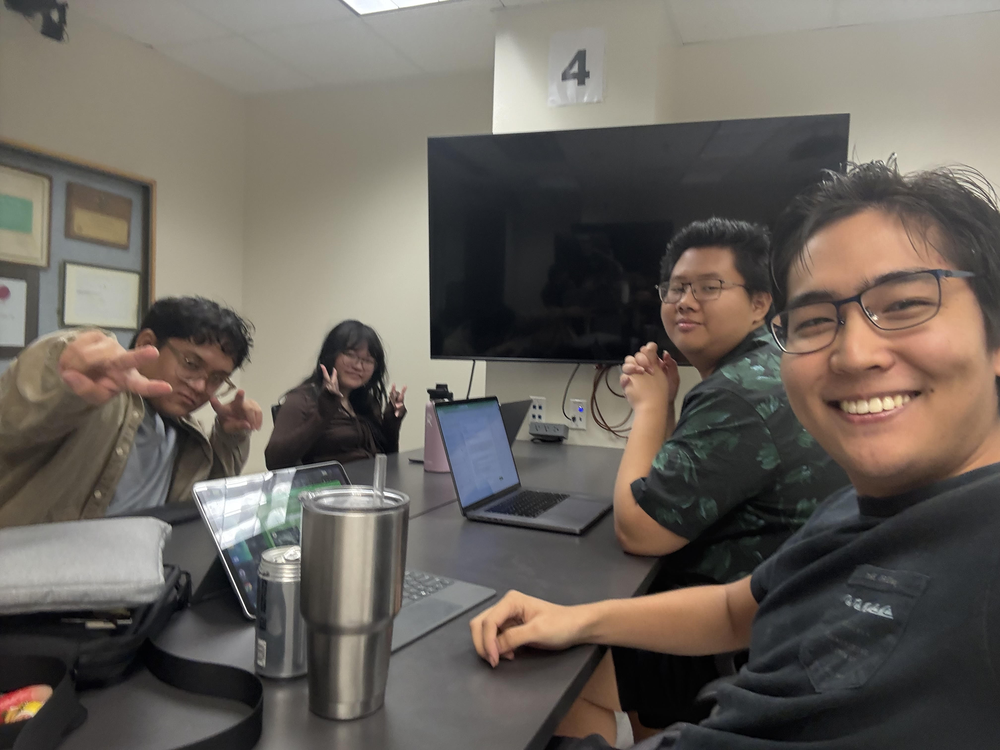 -->

In the very beginning, I teamed up with four classmates and one community volunteer in my software engineering class, which my college refer as ICS 314, for final project of the course. One requirement of the final project was that it solves an existing issue in the [University of Hawaiʻi at Mānoa](https://manoa.hawaii.edu/) or the nearby community. We all had great ideas of what to do for the final project, and we have to pick one that we believe is the best: the one that best fit the skill and ability we have got, the one that solves the biggest problem, and the one that is doable within the project time limit of 4.5 weeks.

One teammate suggested online trash can map for the final project because there may be needs for disposing garbage like lunch boxes and plastic water bottles; another thought an online student market place so there is a better place for stuffs that gets thrown away during dormitory move-out period. My idea was a [landscape collection game](https://mike-yuhang-wu.github.io/essays/project-one-diamond-matrix.html), because there are so much beautiful scenes in the Mānoa campus that got ignored. We discussed and voted, and we all came to an agreement that online trash can map is too easy and the problem it solves is too *light*—there is trash can every where on the Mānoa campus and thus it is not hard to find a trash can. The landscape collection game sounded difficult (although I thought it would be easy) for us, especially the large interactive map and plots that it will have. Therefore we eventually decided to implement an online student market. A few variants of it are Wonkes Market, Wonkes Mānoa Student Market, and Wonkers Bonkers.

Naming stuff had always been a confusing problem to me, however, we did not have a hard time getting a name for the project as a team. We picked the first letter from the last name of each teammate, and we get letters E, K, N, O, and W. We considered many decorated combinations we can have with these five letters, such as The Woken, The Knowers, and The Monkes. We voted on these names and Wonkes won. Since then, Wonkes become the name of our online student market project.

## Overview

There are two main parts of Wonkes: 1[homepage](https://wonkes-manoa.github.io/) and its [storefront](https://wonkes.vercel.app/). The Wonkes homepage is where people read about details of Wonkes project, its implementation, and the milestones we went through. The Wonkes storefront is where users make listings and sell stuffs. Each Wonkes part is in individual GitHub repository under the same [GitHub organization](https://github.com/wonkes-manoa). To see the repository for the homepage, click [here](https://github.com/wonkes-manoa/wonkes-manoa.github.io); to see the repository for the storefront, click [here](https://github.com/wonkes-manoa/manoa-student-market).

A very small amount of workload falls to the Wonkes homepage: authoring an introduction article for Wonkes, writing a manual regarding how to use Wonkes, reporting the progress of the Wonkes project, and keeping all screenshots up to date. However, the jobs here does require a huge amount of understanding of how Wonkes were built, and why it is built that way, and what disadvantage is in the way it is built. For example, the author has to know that Wonkes accept unique username during sign up because username will be used by the users to distinguish other users, and the author has to explain that while going over how to use Wonkes. Another example would be the database structure in the developer guide in the Wonkes homepage. Although we were only able to upload an image of the database structure, the author were expected to know why database is structured the way it is, including which fields has unique or case constraint and why.

On the other hand, about 90% of the workload falls to the Wonkes storefront. Although we start the project with a template that already contains implementation for harsh stuffs like authentication, there is tremendous number of pages to develop or redesign, and additionally some of the existing implementation from the template did not perfectly fit the need of Wonkes and needed changes.

## Teamwork

We used a technique called issue driven project management while working on Wonkes. Which means, we first plan the things to do, and second we make a list of these things which we will call them issues, and third everyone grab an issue that they think they can finish and start working. The list of issues will be on the GitHub repository. Once a teammate finish with an issue, he or she will close the issue on the list and grab a new one (or technically speaking, assign himself or herself a new one). In brief, the completion of the whole project is driven by completing each small issues one by one simultaneously by each teammate.

In addition to planning issues to list on GitHub, we estimate the time it take to finish each issue, so a teammate can use that to consider if he or she has enough time to finish an issue. That is called [effort estimation](https://mike-yuhang-wu.github.io/essays/effort-estimation.html).

Each member of our team has different strengths, so with the way we split tasks using issue driven project management, we each was able to pick the tasks we can do. For example, Darilyn and Josh are good at front end (e.g. user interface), so they primarily pick issues that relates to the front end; Andrew and Brian are better at back end (e.g. database), so they primarily pick issues that relates to the back end. For me, I knew everything a little so I picked from all kinds of issues. I set up backend stuffs at the beginning and worked on both ends afterwards. Our [team contract](https://docs.google.com/document/d/1qroZlpwSoKRgaHdcHW84i6tGcFYL_FecpEvVHpQUUd8/edit?tab=t.0#heading=h.mobo0m5sq6vj) has more details about how we collaborate.

## My contribution

There are three milestones we set up for Wonkes. My contributions mainly scattered on [milestone 1](https://github.com/orgs/wonkes-manoa/projects/1) and [milestone 2](https://github.com/orgs/wonkes-manoa/projects/2), and a few in [milestone 3](https://github.com/orgs/wonkes-manoa/projects/3), as you can see in the list of issues on GitHub by clicking these links.

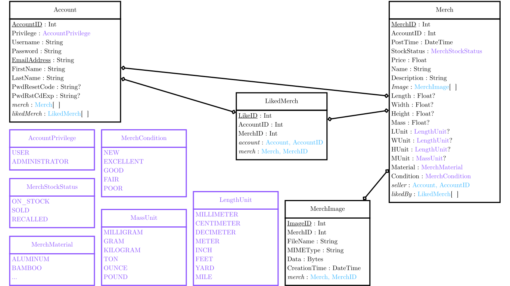

The first major contribution of mine was the design and set up of the database. I picked this issue because I had experience working with relational database when I worked as a part-time full stack developer at the International Structural Engineering and Construction Society, thus I am confident that I can design a good and working structure for the database. It turns out that my design worked without any error, but nevertheless there is improvements can be made.

The picture at the left shows the final database structure of Wonkes. It is slightly different from my original design as it went through a few updates. Originally the merchandise image data are in the table called `Merch`, which is the table where other merchandise information are stored. I moved image data into an individual table called `MerchImage` for clearer structure. Moreover, one of our teammate added a table called `LikedMerch` that stores the like information.

The second major contribution of mine was the edit of the authenticate system. The template we use to develop Wonkes uses email address and password as sign in credentials. However, we decided to use username and password for Wonkes as sign in credential, and therefore a change has to be made on the authenticate system. I took ten hours in total to complete this task. ChatGPT was being very helpful with figuring where changes needs to be made.

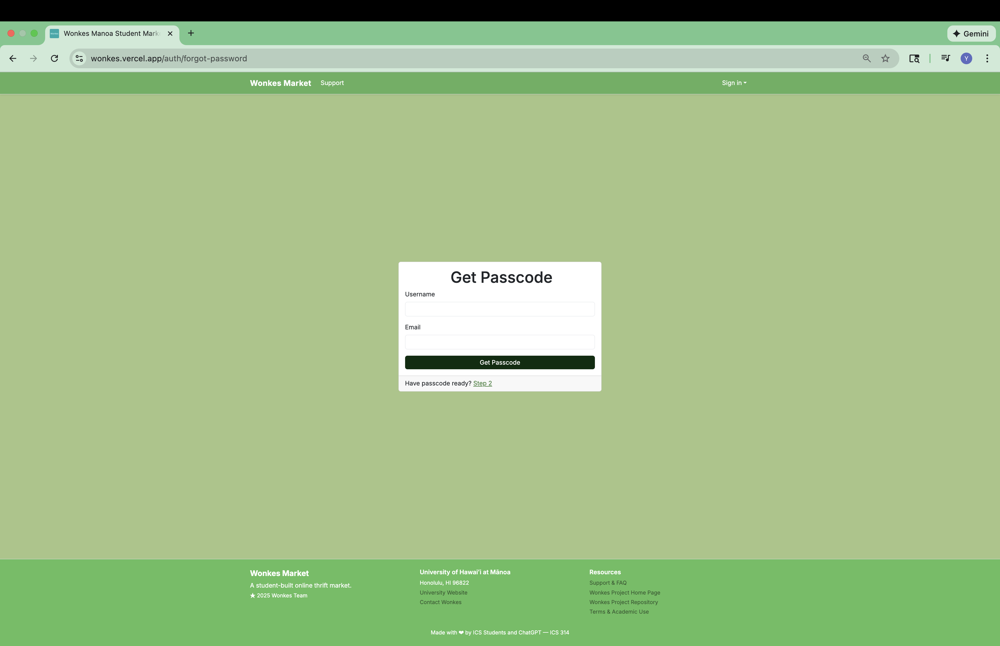

The third major contribution of mine was the implementation of the emailing system, which is used with the reset forgotten password feature that I implemented. When an user reset the account password that they forgot, we send an email containing a randomly generated 6-digit passcode to the email address the user used to create their Wonkes account. The user will use that passcode to prove that they are the real account owner by entering that passcode on the Wonkes website.

The first step was to find a provider that will send email for us, and considering our pity budget, the provider should offer a free or cheap tier. ChatGPT suggested Resend, which we get to send 3,000 emails for free. After a total of four hours writing code and dealing with Resend API, the first email from Wonkes sent successfully.

    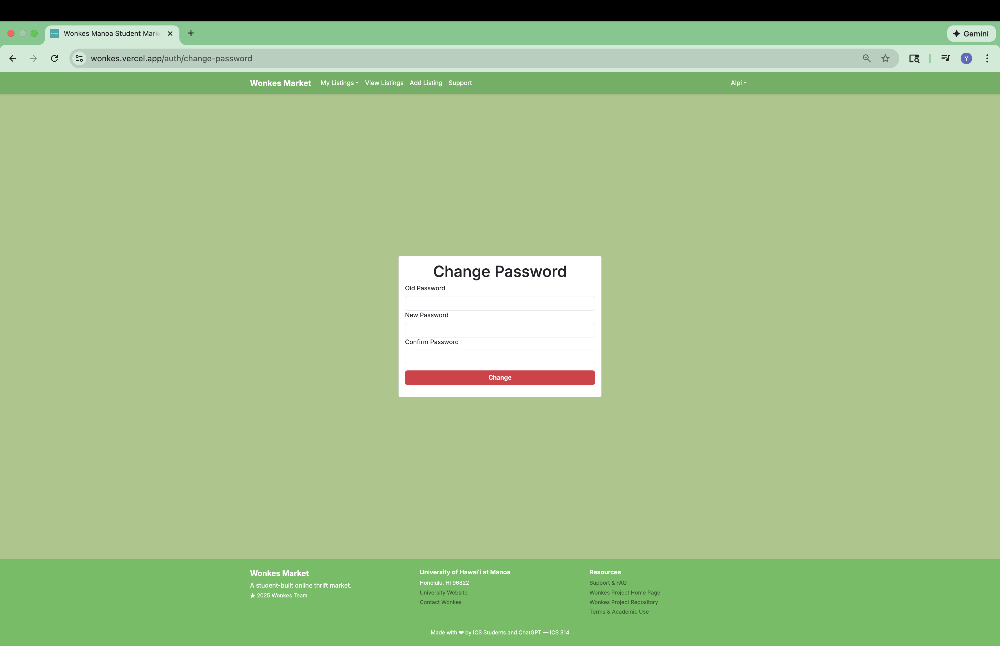
    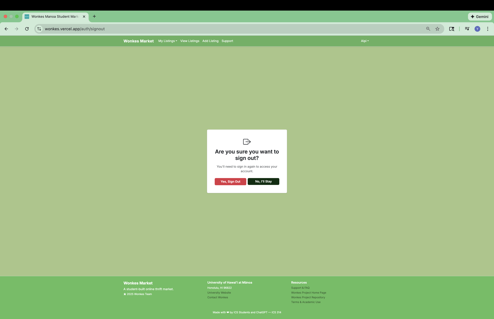
    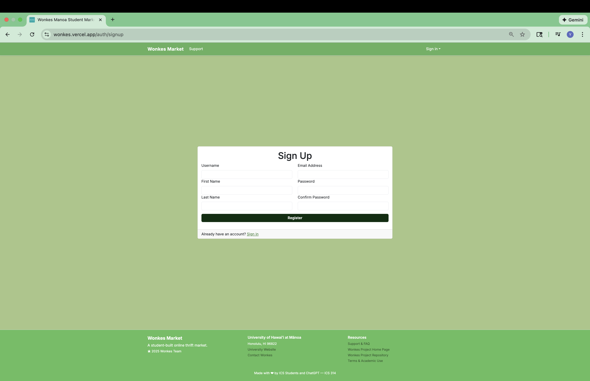
    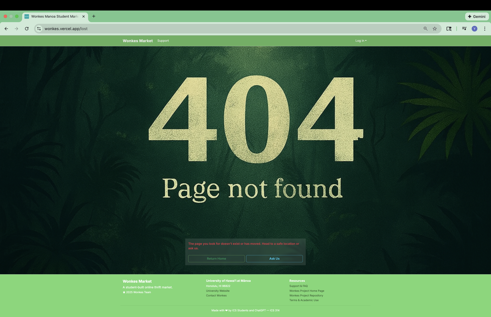
    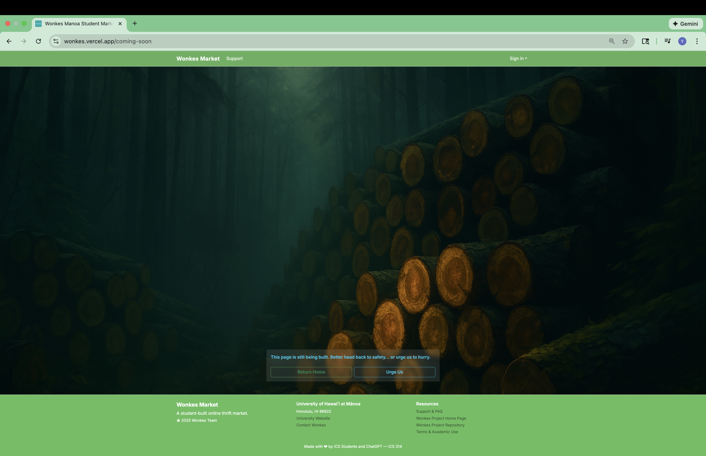
    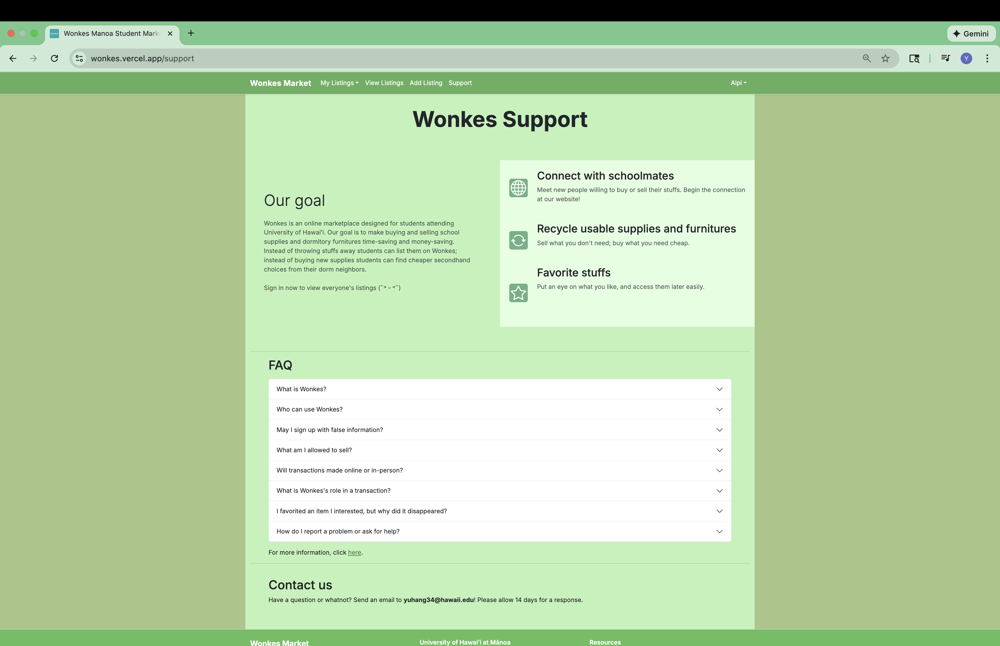
    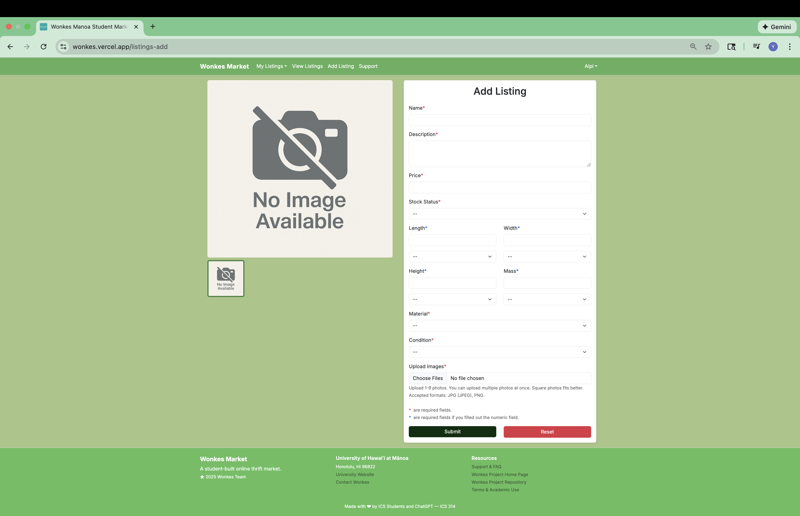
    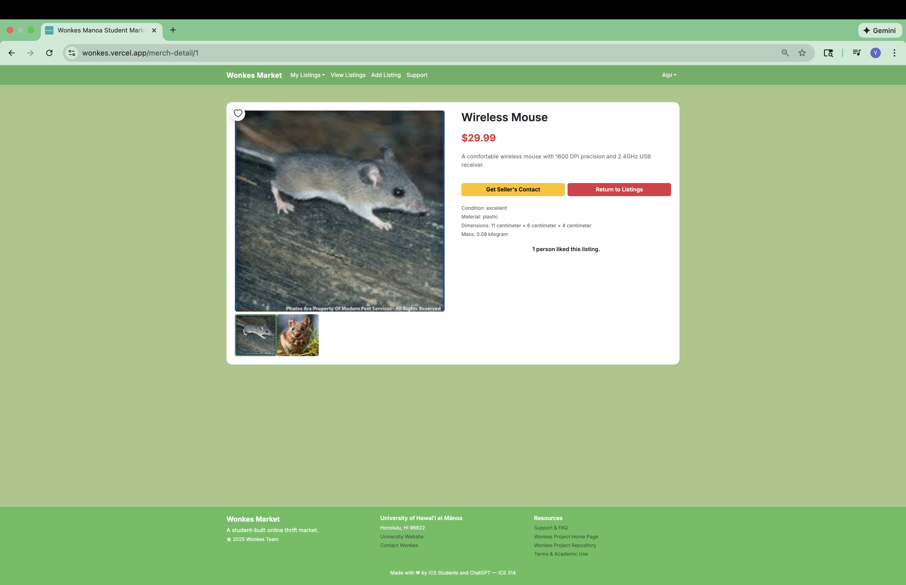
    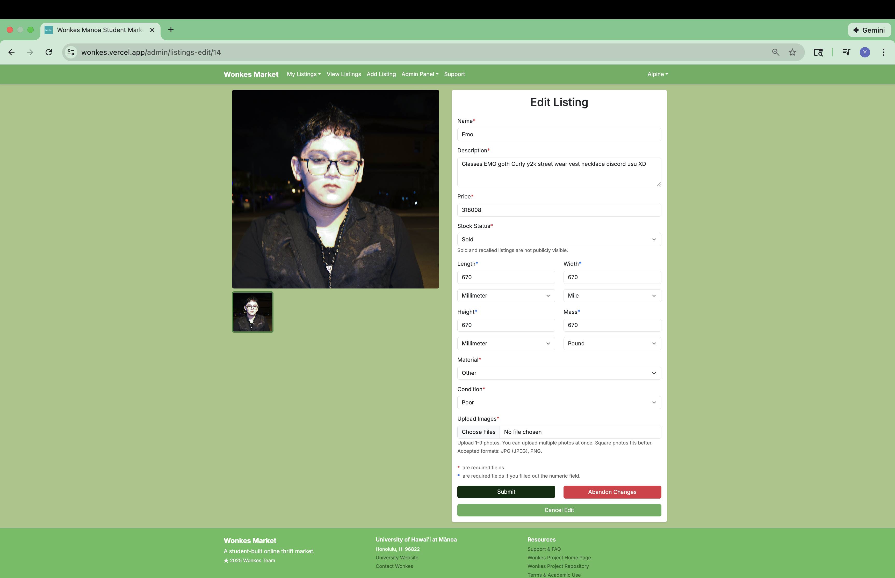
    
    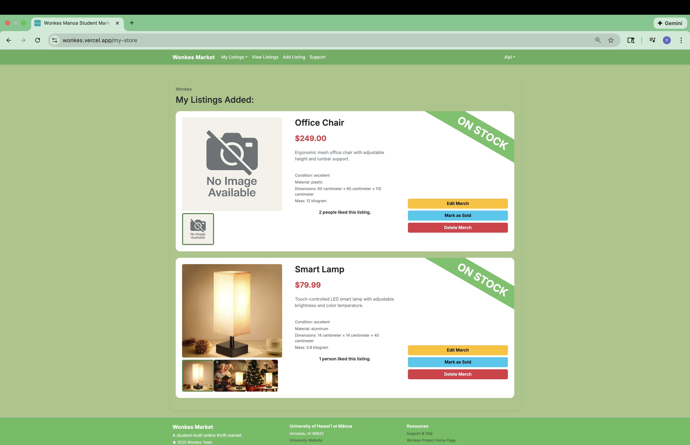
    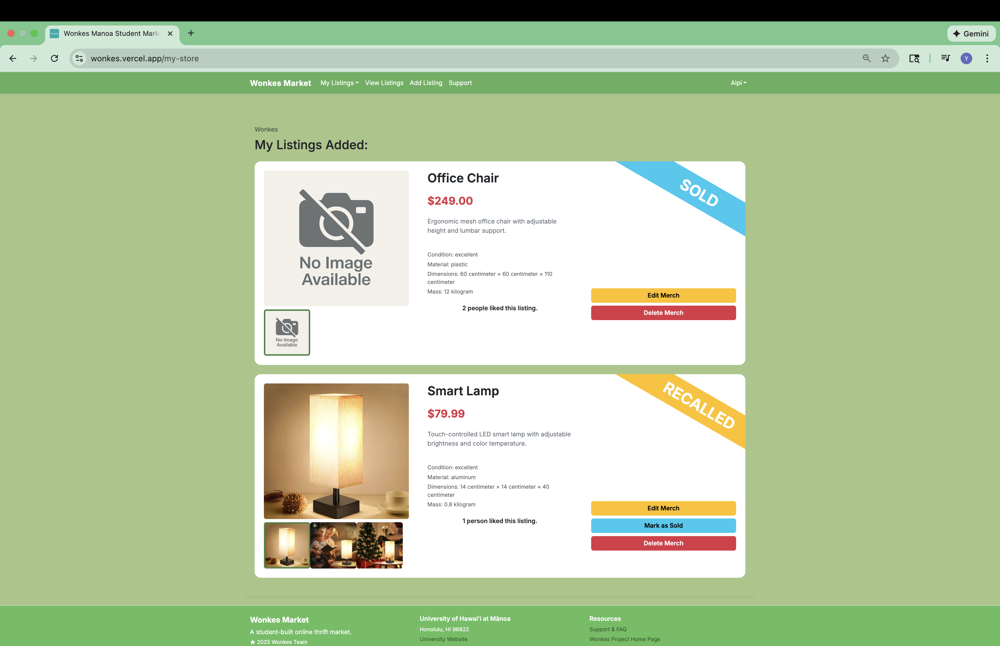
    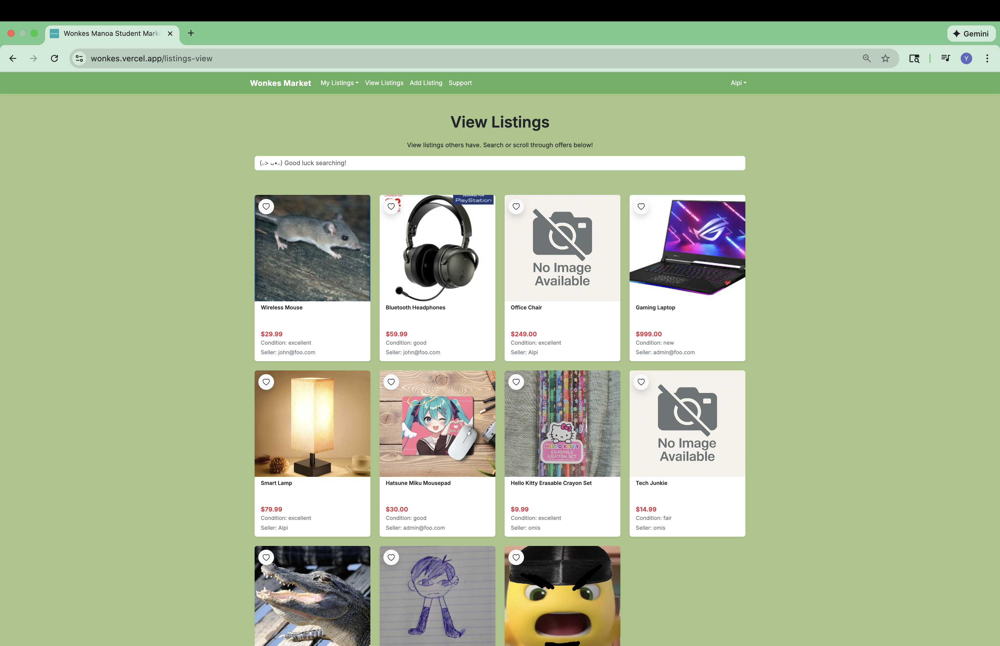

Other contributions of mine include change password page, sign out page, part of the sign up page, 404 not found page, coming-soon page, part of the support page, add listing page, listing detail page, edit listing page, my store page, part of the listing card component in the view listing page, design of Wonkes logo and icon with ChatGPT, and the editing of the text in the Wonkes homepage.

1Unfortunately, Wonkes did not survive the 2025 winter due to limited budget, and the link to its storefront may no longer work.
